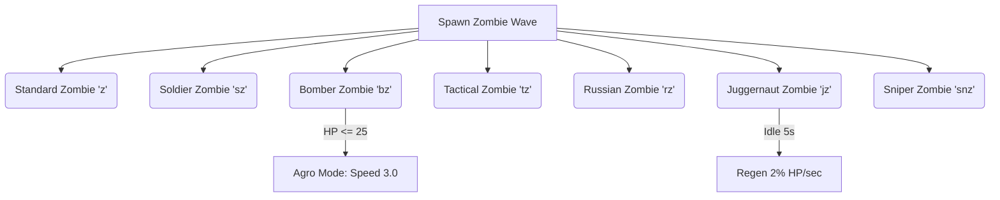

# 📋 BATTLE OF DOOM — Comprehensive Game Data Spec Sheet

This document compiles the exhaustive technical specifications, math progression formulas, weapon damage tables, defensive gear values, items storage rules, and administrative cheat modifications directly parsed from the **Warzone Launcher** (`game.js`) engine codebase.

---

## 🔫 1. Weapon Arsenal (Core Ballistics)

| Identifier | Class / Style | Cost | Type | Base Dmg | HS Mult | Leg Mult | Projectile Speed | Gravity Drop | Spread | Recoil | Mag | RPM | Reload Time | Caliber / Ammo Type | Speed Mod |
| :--- | :--- | :--- | :--- | :--- | :--- | :--- | :--- | :--- | :--- | :--- | :--- | :--- | :--- | :--- | :--- |
| **AR15** | `rifle` | $0 | semi | 7.0 | 2.0x | 0.8x | 65 | 0.0030 | 0.021 | 4.0 | 20 | 500 | 2.5s | `.223 rem` | 1.00x |
| **UZI** | `pistol` | $100 | auto | 4.0 | 1.5x | 0.7x | 35 | 0.0900 | 0.050 | 4.0 | 32 | 1200 | 1.8s | `9mm` | 1.00x |
| **GLOCK 19** | `pistol` | $250 | semi | 6.0 | 1.9x | 0.8x | 45 | 0.0100 | 0.042 | 1.2 | 19 | 600 | 1.5s | `9mm` | 1.00x |
| **GLOCK 18C** | `pistol` | $1,000 | auto | 6.0 | 1.9x | 0.8x | 45 | 0.0100 | 0.100 | 1.2 | 60 | 1000 | 4.0s | `9mm` | 1.00x |
| **MP5** | `rifle` | $400 | auto | 6.0 | 2.2x | 0.7x | 45 | 0.0100 | 0.050 | 2.5 | 30 | 700 | 2.0s | `9mm` | 1.00x |
| **REVOLVER** | `pistol` | $500 | semi | 10.0 | 2.5x | 0.8x | 50 | 0.0210 | 0.060 | 8.0 | 6 | 200 | 2.0s | `44 mag` | 1.00x |
| **M4A1** | `rifle` | $1,200 | auto | 11.0 | 2.0x | 0.8x | 65 | 0.0020 | 0.035 | 6.0 | 30 | 650 | 2.2s | `.223 rem` | 1.00x |
| **M249** | `lmg` | $1,500 | auto | 10.0 | 2.0x | 0.8x | 65 | 0.0030 | 0.045 | 7.5 | 150 | 800 | 6.0s | `.223 rem` | 0.85x |
| **AK47** | `rifle` | $720 | auto | 15.0 | 2.2x | 0.8x | 60 | 0.0025 | 0.063 | 6.5 | 30 | 480 | 2.5s | `7.62x62 soviet` | 1.00x |
| **SPAS-12** | `shotgun_tube` | $900 | auto | 4.0 | 1.3x | 1.0x | 45 | 0.0120 | **0.084** | 8.0 | 8 | 200 | 3.5s | `12gauge` (12 pellets) | 1.00x |
| **M500** | `shotgun_tube` | $350 | pump | 5.0 | 1.3x | 0.8x | 50 | 0.0150 | **0.084** | 9.5 | 8 | 50 | 4.0s | `12gauge` (12 pellets) | 1.00x |
| **M110K** | `rifle` | $2,200 | semi | 8.0 | 3.2x | 1.0x | 75 | 0.0010 | 0.012 | 8.0 | 15 | 620 | 2.8s | `.308 win` | 1.00x |
| **AS-VAL** | `rifle` | $5,000 | auto | 6.0 | 2.0x | 0.5x | **20** | **0.0450** | 0.012 | 3.5 | 30 | 900 | 2.4s | `9x39 subsonic` | 1.00x |
| **R700** | `bolt` | $1,000 | bolt | 32.0 | 3.5x | 1.0x | 80 | 0.0010 | 0.003 | 15.0 | 5 | 50 | 3.5s | `.308 win` | 1.00x |
| **M82A1** | `bolt` | $10,000 | semi | 35.0 | 3.0x | 1.0x | 150 | 0.0005 | 0.001 | 28.0 | 10 | 500 | 5.0s | `.50 bmg` | 1.00x |
| **SVD** | `rifle` | $3,000 | semi | 15.0 | 3.0x | 1.0x | 100 | 0.0050 | 0.015 | 9.5 | 10 | 620 | 2.8s | `7.62x54 mmr` | 1.00x |
| **PKM** | `lmg` | $12,000* | auto | 12.0 | 2.5x | 1.0x | **100** | 0.0100 | 0.045 | 8.0 | 100 | 900 | 5.0s | `7.62x54 mmr` | 0.85x |
| **SKS** | `clip` | $500 | semi | 12.0 | 3.0x | 0.7x | 60 | 0.0025 | 0.005 | 8.0 | 10 | 600 | 1.5s | `7.62x62 soviet` | 1.00x |
| **SCAR-H** | `rifle` | $7,500 | auto | 16.0 | 2.0x | 1.0x | 75 | 0.0020 | 0.035 | 7.5 | 20 | 670 | 2.5s | `.308 win` | 0.95x |
| **Saiga-12** | `rifle` | $5,000 | auto | 4.0 | 1.3x | 1.0x | 45 | 0.0120 | 0.0588 | 12.0 | 10 | 250 | 2.75s | `12gauge` (12 pellets) | 1.00x |
| **Renelli M4** | `shotgun_tube` | $5,000 | auto | 6.0 | 1.5x | 1.0x | 45 | 0.0120 | 0.084 | 12.0 | 7 | 200 | 0.9s | `12gauge` (12 pellets) | 1.00x |
| **AWM** | `bolt` | $6,000 | semi | 38.0 | 4.0x | 1.0x | 150 | 0.0010 | 0.0005 | 35.0 | 10 | 30 | 3.5s | `.50 bmg` | 0.85x |

> [!NOTE]
> **Shotguns (SPAS-12, M500)** fire a tight cluster of individual pellets simultaneously. The base damage listed in the table is calculated *per pellet*. A full body hit at point-blank range deals:
> *   `SPAS-12` (12 pellets): 4.0 * 12 = **48.0 Damage**
> *   `M500` (12 pellets): 5.0 * 12 = **60.0 Damage**

> [!TIP]
> **Ammunition Penetration Multipliers (Armor Mitigation Bypass):**
> High-caliber rounds bypass a portion of the target's armor or helmet mitigation using a penetration multiplier (`penMult`), reducing its protection percentage:
> *   **0.975x pen** (Standard for `9mm`, `44 mag`, `12gauge`): Armor/helmet provides near-full base mitigation.
> *   **0.9x pen** (Light AP, `.223 rem`): Decreases armor protection factor by 10% (e.g. 50% mitigation becomes 45%).
> *   **0.75x pen** (Medium AP, `7.62x62 soviet`): Decreases armor protection factor by 25% (e.g. 50% mitigation becomes 37.5%).
> *   **0.67x pen** (Heavy AP, `.308 win`): Decreases armor protection factor by 33% (e.g. 50% mitigation becomes 33.5%).
> *   **0.65x pen** (Heavy AP, `7.62x54 mmr`): Decreases armor protection factor by 35% (e.g. 90% mitigation becomes 58.5%).
> *   **0.34x pen** (Tactical subsonic AP, `9x39 subsonic`): Decreases armor protection factor by 66% (e.g. 90% mitigation becomes 30.6%).
> *   **0.3x pen** (Heavy anti-materiel, `.50 BMG`): Decreases armor protection factor by 70% (e.g. 90% mitigation becomes 27%).

---

## 🧟 2. Zombie & Enemy Units (AI Spec)

### 🦠 Standard & Bomber Zombie Scaling

*   **Standard Zombie (`z`)**: 
    *   **Health:** `HP = 50 + 5 * (Wave - 1)`
    *   **Speed:** `Speed = 1.3 + 0.001 * (Wave - 1)`
    *   **Radius:** `0.30`
    *   **Abilities:** Basic melee swipes. Drops coins ranging from `$50` to `$199` on death.
*   **Soldier Zombie (`sz`)**:
    *   **Health:** `HP = 20 + 7 * (Wave - 1)`
    *   **Speed:** `1.0 (Static)`
    *   **Radius:** `0.30`
    *   **Equipment:** T1 Helmet (`mit: 0.25, dur: 100`)
    *   **Loadouts:** Spawns with one of three firearm variants:
        *   *Z-AR (20% chance):* Damage 8.0, RPM 550, Speed 40.
        *   *Z-Pistol (35% chance):* Damage 6.0, RPM 250, Speed 35.
        *   *Z-Shotgun (45% chance):* Damage 4.0 (x6 pellets), RPM 50, Speed 28.
    *   **Abilities:** Shoots at player, strafes left/right (`sDir`) every few seconds. Drops coins ranging from `$200` to `$500` on death.
*   **Bomber Zombie (`bz`)**:
    *   **Health:** `HP = 50 (Static)`
    *   **Speed:** `0.5 (Base)` $\rightarrow$ **Agro Speed:** `3.0` (Triggers instantly when HP drops to `25` or below)
    *   **Radius:** `0.35`
    *   **Abilities:** Explodes upon reaching melee range, dealing high area-of-effect damage. Drops coins ranging from `$150` to `$349` on death.

---

### 🎖️ Elite Combat Variants

| Variant Code | Base HP | Armor (T-Class) | Helmet (T-Class) | Armed Weapon | Movement Speed | Special Traits & Drops |
| :--- | :--- | :--- | :--- | :--- | :--- | :--- |
| **Tactical** (`tz`) | 20 | 50% Mit / 250 Dur | 40% Mit / 100 Dur | M4A1 (`dmg: 11.0`) | 1.4 | High strafe frequency, drops `$200` to `$500` coins |
| **Russian** (`rz`) | 35 | 75% Mit / 500 Dur | 50% Mit / 250 Dur | AK47 (`dmg: 13.0`) | 1.2 | Explodes high-power bullets, drops `$200`-`$500` coins + **Red Floppy Disk** (100%) |
| **Juggernaut** (`jz`) | 100 | 75% Mit / 500 Dur | 50% Mit / 500 Dur | M249 (`dmg: 10.0`) | 0.8 | Regenerates 2% of max health per second if idle for 5s, drops **$2,500** + **Black Floppy Disk** (100%) |
| **Sniper** (`snz`) | 10 | N/A | N/A | R700 (`dmg: 32.0`) | 0.5 | 80% headshot rate, 33% accuracy, ghillie suit camouflage, drops `$200` to `$500` coins |

---

## 🎒 3. Defensive Gear & Items Spec

### 🛡️ Armor Plates (Mitigation & Durability)

| Gear Item | Cost | Tier | Damage Mitigation | Durability Capacity | Speed Modifier | Special Rules |
| :--- | :--- | :--- | :--- | :--- | :--- | :--- |
| **Police Vest** | $500 | Tier 1 | 25% Reduction | 100 Durability | 1.00x | Reduces aim-flinch by 25% |
| **Military Vest** | $2,500 | Tier 2 | 50% Reduction | 250 Durability | 1.00x | Reduces aim-flinch by 50% |
| **Ratnic Vest** | $5,000 | Tier 3 | 75% Reduction | 300 Durability | 0.85x | Reduces aim-flinch by 75% |
| **Assault Vest** | $7,000 | Tier 4 | 90% Reduction | 500 Durability | 0.80x | Reduces aim-flinch by 90% · Crow Merchant: 1x Red & 1x Black Floppy |

### 🪖 Helmets & Visors (Head Protection)

| Helmet Gear | Cost | Tier | Mitigation | Visor Mit | Visor Toggleable | Durability | Concussion Red | Speed Mod | Special Rules |
| :--- | :--- | :--- | :--- | :--- | :--- | :--- | :--- | :--- | :--- |
| **Motorcycle Helmet** | $700 | Tier 1 | 25% | N/A | No | 100 | 50% | 1.00x | Lightweight protection |
| **Police Helmet** | $1,500 | Tier 2 | 40% | N/A | No | 100 | 50% | 1.00x | Police utility |
| **Military Helmet** | $3,000 | Tier 3 | 50% | N/A | No | 200 | 80% | 0.95x | Strong protection and concussion reduction |
| **Altyn Helmet** | $5,000 | Tier 4 | 50% | 75% | **Yes (Visor)** | 300 | 100% (Visor down) | 0.85x | Visor toggling down blocks stuns; takes 50% less durability dmg when visor is down |

> [!IMPORTANT]
> **Visor Toggle Mechanics:** When carrying the Tier 4 Altyn Helmet, pressing the visor hotkey (`N`) toggles the visor shield down. This shields the face, increasing mitigation from 50% to **75%** and blocking concussion/flash impacts entirely, but overlays a narrow steel visor slit onto the screen. If the helmet durability breaks, the visor breaks open and the overlay disappears automatically.

---

### ⚙️ Armor Penetration & Mitigation Formula

Damage received to mitigated regions (chest/head) scales according to active armor durability and bullet caliber:

$$\text{Damage Received} = \text{Base Damage} \times (1 - \text{Mitigation} \times \text{penMult})$$

| Caliber / Ammo Type | Armor Mitigation Multiplier (`penMult`) | Durability Damage Taken (`durDmg`) |
| :--- | :--- | :--- |
| `9mm` | 0.975 | 5 |
| `44 mag` | 1.00 | 10 |
| `.223 rem` | 0.90 | 30 |
| `12gauge` | 1.00 | 10 (per pellet) |
| `9x39 subsonic` | 0.34 | 35 |
| `7.62x62 soviet` | 0.75 | 20 |
| `7.62x54 mmr` | 0.65 | 25 |
| `.308 win` | 0.67 | 50 |
| `.50 bmg` | 0.30 | 100 |
| **M67 Grenade (AOE)** | 0.50 (Flat) | 100 (Flat) |

---

### 📦 Backpacks (Storage Scaling)

Storage starts at a **9-slot grid** baseline. Purchasing backpacks expands slot availability:
*   **Traveler's Backpack** ($3,000): Adds 8 storage slots (Total **17 slots**).
*   **Military Backpack** ($5,000 + 1x Red Floppy Disk): Adds 15 storage slots (Total **24 slots**). Requires both Cash and an elite Red Floppy Disk drop.
*   **Duffle Bag** ($12,000 + 1x Black Floppy Disk): Adds 30 storage slots (Total **39 slots**). Requires both Cash and a legendary Black Floppy Disk drop.

---

### 🩹 Tactical Consumables & Ordinance

*   **Medkit:** Cast Time: 5s | Heals 2 HP per tick. Single stack.
*   **Large Medkit:** Cast Time: 7s | Heals 5 HP per tick. Single stack.
*   **Bandage:** Cost: $500 | Cast Time: 1s | Heals 1 HP per tick. Max stack: 8.
*   **M67 Grenade:** Cost: $500 | Fuse Time: 3.0s | Damage: 50.0 | Blast Radius: 7.2m | Zombie Stun Time: 3.0s. Max stack: 2.
*   **Ammo Purchases (Crow Merchant):**
    *   `9mm`: $100 for 20 rounds (Max Stack: 100)
    *   `44 mag`: $150 for 16 rounds (Max Stack: 75)
    *   `.223 rem`: $200 for 30 rounds (Max Stack: 50)
    *   `.308 win`: $250 for 10 rounds (Max Stack: 20)
    *   `12gauge`: $100 for 10 rounds (Max Stack: 25)
    *   `9x39 subsonic`: $500 for 30 rounds (Max Stack: 60)
    *   `7.62x62 soviet`: $400 for 30 rounds (Max Stack: 50)
    *   `.50 bmg`: $1,000 for 10 rounds (Max Stack: 10)
    *   `7.62x54 mmr`: $600 for 30 rounds (Max Stack: 50)

---

## 🏃 4. Player Baseline Stats

*   **Standard Health:** `100 / 100 HP`
*   **Movement Speed:** `2.4 units/sec` (multiplied by equipped weapon `spdMod` and armor `spdMod` penalties).
*   **Stamina:** `100 / 100` (Depletes during sprinting, recovers when walking/idle).
*   **Raycast Horizon Pitch Limits:** `-450px` to `+450px` (y-axis camera viewing lock).
*   **Flinch Recovery:** Flinch shifts camera offset upwards (`STATE.flinchY`) and decays linearly back to zero over time. Flinch intensity is mitigated by active vests.
    *   *Zombie Melee Flinch:* +150px
    *   *Bullet Body Shot Flinch:* +350px
    *   *Bullet Headshot Flinch:* +650px

---

## 🎯 5. Hitmarker Visual Indicators

The HUD crosshair overlays high-precision hit markers upon landing shots on target entities:

| Hit Type | Crosshair overlay shape | Visual Color | Duration |
| :--- | :--- | :--- | :--- |
| **Body Hit** | Standard diagonal cross (X) | White (`#ffffff`) | 220ms |
| **Headshot** | Rotated cross (+) + center diamond | White (`#ffffff`) | 220ms |
| **Kill Shot** | Large diagonal cross (X) | Red (`#ff2020`) | 380ms |

---

## 🛡️ 6. anti-cheat System (WAC)

WAC operates an automated detection layer targeting memory, DOM mutations, and script injections:

| Exploit Type / Vector | Detection Method | Trigger Action |
| :--- | :--- | :--- |
| **Console Injection (`eval`)** | Monkeypatches `window.eval` to detect execution calls. | Instant Ban |
| **Console Injection (`Function`)** | Monkeypatches `window.Function` constructor hooks. | Instant Ban |
| **External Scripts** | Mutation Observer monitors DOM `<script>` creations. | Instant Ban |
| **Cheat UI Elements** | Scans newly added elements for signature classes/IDs. | Instant Ban |
| **External Visual Overlays** | Detects floating Canvas layers with high z-index values. | Instant Ban |
| **Exploit Tool Memory** | Scans global namespace for `CheatEngine` or `Exploit`. | Instant Ban |
| **Bypass Staff Authority** | Detects `staffLoggedIn = true` without verified handshake. | Instant Ban |

> [!WARNING]
> **Ban Persistence:** Ban records write directly to Electron persistence / LocalStorage via `STORAGE.setBan()`. Bans lock out players from deploying into matches for **1 hour**. An administrative panel toggle allows moderators to clear active bans.

---

## ⚙️ 7. Cheat & Modifier Parameter Overrides

These global variables in the `ADMIN` namespace override standard game rules when cheat toggles are turned on:

*   `ADMIN.godmode`: Nullifies all damage taken by the player.
*   `ADMIN.infiniteStamina`: Bypasses stamina depletion logic.
*   `ADMIN.noclip`: Disables map coordinate bounds and wall collision checking.
*   `ADMIN.flyhack`: Removes gravity acceleration while preserving boundary collisions.
*   `ADMIN.speedVal`: Base multiplier for player speed (`2.0` default).
*   `ADMIN.jumpVal`: Adjusts jump upward velocity (`4.8` default).
*   `ADMIN.reloadSpeed`: Reload time multiplier (`1.0` default - lower is faster).
*   `ADMIN.aimSmooth`: Interpolates crosshair turning angle (`1` is instant, higher is smoother).
*   `ADMIN.hitboxExpansion`: Scales target hitbox dimensions (both vertical bounds and radius).
*   `ADMIN.fovIncreaser`: Scales `STATE.fMult` to expand horizontal FOV angles.
*   `ADMIN.autoJump`: Automatically executes perfectly-timed jumps in the movement loop.
*   `ADMIN.targetSwapDelay`: Configurable delay (in milliseconds) before aimbot switches targets.
*   `ADMIN.targetSnapline`: Draws a direct visual tracker connecting the crosshair to the active aimbot target.
*   `ADMIN.radialShape`: Sets the geometric shape for FOV Radials (`circle`, `square`, `hexagon`, etc).
*   `ADMIN.myHitboxExpansion`: Independently scales the local player's hitbox size, separate from enemy hitboxes.
*   `ADMIN.hitboxShape`: Selects the 3D visualizer shape for hitboxes (`sphere`, `box`, `cylinder`).
*   `ADMIN.hitboxXray`: Toggles hitbox visualizer rendering through walls/occlusion.
*   `ADMIN.hitboxWireframe`: Toggles rendering hitboxes as wireframes instead of solid materials.

---

## 🌐 8. Multiplayer Connection (Direct P2P)

The Warzone Launcher uses a direct Peer-to-Peer (P2P) network architecture powered by PeerJS:

*   **Signaling Channel:** Uses public WebRTC STUN/TURN servers to exchange connection endpoints between peers.
*   **Room Matching:** Generates a unique, random 6-character room matching code (prefixed with `bod-` in memory) to link clients.
*   **Host Relaying Mechanics:** The player hosting the match acts as the central network hub. The host relays client movements, shots, hits, and coordinates directly to all other connected peers.
*   **Performance:** Direct client-to-client connection minimizes latency and eliminates intermediate server forwarding overhead.

# ⚔️ BATTLE OF DOOM — PvP Weapons & Combat Data Sheet

This document compiles the PvP-specific ballistics, damage multipliers, and caliber mechanics parsed from the **Warzone Launcher** (`PVP_STATS` override layer).

---

## 🔫 1. PvP Weapon Combat Metrics

In PvP Mode, weapon base damages and headshot multipliers are overridden by the `PVP_STATS` config block. Leg damage multipliers use the base weapon stats as a fallback. 

| Weapon Name | Caliber | Base Dmg | HS Mult | Headshot Dmg | Leg Mult | Leg Damage | Armor Pen (`penMult`) | Durability Loss |
| :--- | :--- | :---: | :---: | :---: | :---: | :---: | :---: | :---: |
| **AR15** | `.223 rem` | 18.0 | 2.0x | **36.0** | 0.8x | **14.4** | 0.90x | 30 |
| **M4A1** | `.223 rem` | 21.0 | 2.0x | **42.0** | 0.8x | **16.8** | 0.90x | 30 |
| **M249** | `.223 rem` | 22.0 | 2.0x | **44.0** | 0.8x | **17.6** | 0.90x | 30 |
| **SCAR-H** | `.308 win` | 22.0 | 2.0x | **44.0** | 1.0x | **22.0** | 0.67x | 50 |
| **AWM** | `.50 bmg` | 70.0 | 1.8x | **126.0** | 1.0x | **70.0** | 0.30x | 100 |
| **UZI** | `9mm` | 11.0 | 1.3x | **14.3** | 0.7x | **7.7** | 0.975x | 5 |
| **GLOCK 19** | `9mm` | 13.0 | 1.9x | **24.7** | 0.8x | **10.4** | 0.975x | 5 |
| **GLOCK 18C** | `9mm` | 13.0 | 1.9x | **24.7** | 0.8x | **10.4** | 0.975x | 5 |
| **MP5** | `9mm` | 14.0 | 2.0x | **28.0** | 0.7x | **9.8** | 0.975x | 5 |
| **REVOLVER** | `44 mag` | 25.0 | 4.0x | **100.0** | 0.8x | **20.0** | 1.00x | 10 |
| **AK47** | `7.62x62 soviet` | 25.0 | 2.2x | **55.0** | 0.8x | **20.0** | 0.75x | 20 |
| **SPAS-12** | `12gauge` (12 pellets) | 6.0 | 1.3x | **7.8** (x12) | 1.0x | **6.0** (x12) | 1.00x | 10 (per pellet) |
| **M500** | `12gauge` (12 pellets) | 8.0 | 1.3x | **10.4** (x12) | 0.8x | **6.4** (x12) | 1.00x | 10 (per pellet) |
| **Saiga-12** | `12gauge` (12 pellets) | 7.0 | 1.3x | **9.1** (x12) | 1.0x | **7.0** (x12) | 1.00x | 10 (per pellet) |
| **Renelli M4** | `12gauge` (12 pellets) | 10.0 | 1.5x | **15.0** (x12) | 1.0x | **10.0** (x12) | 1.00x | 10 (per pellet) |
| **M110K** | `.308 win` | 28.0 | 4.0x | **112.0** | 1.0x | **28.0** | 0.67x | 50 |
| **AS-VAL** | `9x39 subsonic` | 10.0 | 3.0x | **30.0** | 0.5x | **5.0** | 0.34x | 35 |
| **R700** | `.308 win` | 31.0 | 4.0x | **124.0** | 1.0x | **31.0** | 0.67x | 50 |
| **M82A1** | `.50 bmg` | 60.0 | 2.0x | **120.0** | 1.0x | **60.0** | 0.30x | 100 |
| **SVD** | `7.62x54 mmr` | 36.0 | 3.0x | **108.0** | 1.0x | **36.0** | 0.65x | 25 |
| **PKM** | `7.62x54 mmr` | 20.0 | 2.0x | **40.0** | 1.0x | **20.0** | 0.65x | 25 |
| **SKS** | `7.62x62 soviet` | 20.0 | 4.0x | **80.0** | 0.7x | **14.0** | 0.75x | 20 |

*   *Shotguns (SPAS-12, M500) damage values are listed **per pellet**.*

---

## 🛡️ 2. PvP Armor Protection & Absorption Calculations

Armor absorption in PvP respects caliber-specific bypass rules. The active protection factor of helmets and vests scales directly based on the bullet caliber's `penMult`:

$$\text{Actual Damage Received} = \text{PvP Incoming Damage} \times (1 - \text{Mitigation} \times \text{penMult})$$

### Mitigation Reference Tables

#### Vests (Chest Coverage & Flinch Mitigation)
Higher tier vests reduce aim-flinch intensity by their mitigation percentage.
*   **Police Vest (T1):** 25% Base Mitigation · **100 Durability** $\rightarrow$ Flinch reduced by 25%
*   **Military Vest (T2):** 50% Base Mitigation · **250 Durability** $\rightarrow$ Flinch reduced by 50%
*   **Ratnic Vest (T3):** 75% Base Mitigation · **300 Durability** $\rightarrow$ Flinch reduced by 75%
*   **Assault Vest (T4):** 90% Base Mitigation · **500 Durability** $\rightarrow$ Flinch reduced by 90%

#### Helmets (Head Coverage & Concussion Dampening)
Helmets reduce flash and stun concussion duration by their concussion reduction (`concRed`) percentage.
*   **Motorcycle Helmet (T1):** 25% Base Mitigation · **100 Durability** $\rightarrow$ 50% Concussion Reduction
*   **Police Helmet (T2):** 40% Base Mitigation · **100 Durability** $\rightarrow$ 50% Concussion Reduction
*   **Military Helmet (T3):** 50% Base Mitigation · **200 Durability** $\rightarrow$ 80% Concussion Reduction
*   **Altyn Helmet (T4):** 50% Base Mitigation / **75% with Visor Down** · **300 Durability** $\rightarrow$ 100% Concussion Reduction with Visor Down. Reduces durability damage taken by 50% when visor is down.
