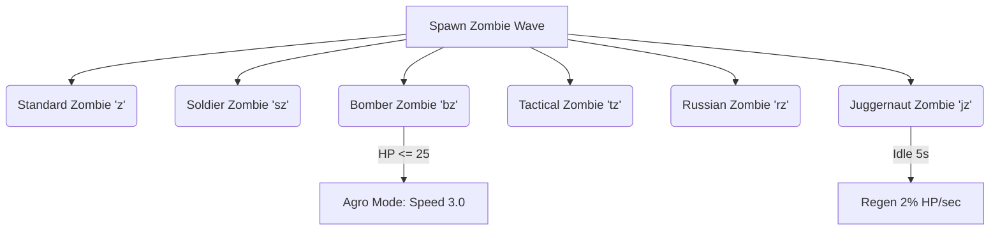

[README.md](https://github.com/user-attachments/files/28203513/README.md)
# BATTLE OF DOOM — Neon Strike Launcher

## Controls

| Key | Action |
|-----|--------|
| WASD | Move |
| Shift | Sprint (uses Stamina) |
| LMB | Fire |
| RMB (hold) | Aim Down Sights |
| Space | Jump |
| R | Reload |
| E | Open Inventory |
| G | Hold Grenade |
| F | Interact (Shop/Doors) |
| N | Cycle Spectate Target (when Spectate is ON) |

# 📋 BATTLE OF DOOM — Comprehensive Game Data Spec Sheet

This document compiles the exhaustive technical specifications, math progression formulas, weapon damage tables, defensive gear values, items storage rules, and administrative cheat modifications directly parsed from the **Warzone Launcher** (`game.js`) engine codebase.

---

## 🔫 1. Weapon Arsenal (Core Ballistics)

| Identifier | Class / Style | Cost | Type | Base Dmg | HS Mult | Leg Mult | Projectile Speed | Gravity Drop | Spread | Recoil | Mag | RPM | Reload Time | Caliber / Ammo Type | Speed Mod |
| :--- | :--- | :--- | :--- | :--- | :--- | :--- | :--- | :--- | :--- | :--- | :--- | :--- | :--- | :--- | :--- |
| **AR15** | `rifle` | $0 | semi | 7.0 | 2.0x | 0.8x | 65 | 0.0030 | 0.021 | 4.0 | 20 | 500 | 2.5s | `.223 rem` | 1.00x |
| **UZI** | `pistol` | $100 | auto | 4.0 | 1.5x | 0.7x | 35 | 0.0900 | 0.050 | 4.0 | 32 | 1200 | 1.8s | `9mm` | 1.00x |
| **GLOCK 19** | `pistol` | $250 | semi | 6.0 | 1.9x | 0.8x | 45 | 0.0100 | 0.042 | 1.2 | 19 | 600 | 1.5s | `9mm` | 1.00x |
| **MP5** | `rifle` | $400 | auto | 6.0 | 2.2x | 0.7x | 45 | 0.0100 | 0.050 | 2.5 | 30 | 700 | 2.0s | `9mm` | 1.00x |
| **REVOLVER** | `pistol` | $500 | semi | 10.0 | 2.5x | 0.8x | 50 | 0.0210 | 0.060 | 8.0 | 6 | 200 | 2.0s | `44 mag` | 1.00x |
| **AK47** | `rifle` | $720 | auto | 15.0 | 2.2x | 0.8x | 60 | 0.0025 | 0.063 | 6.5 | 30 | 480 | 2.5s | `7.62x62 soviet` | 1.00x |
| **SPAS-12** | `shotgun_tube` | $900 | auto | 4.0 | 1.3x | 1.0x | 45 | 0.0120 | 0.168 | 8.0 | 8 | 200 | 3.5s | `12gauge` (12 pellets) | 1.00x |
| **M500** | `shotgun_tube` | $350 | pump | 5.0 | 1.3x | 0.8x | 50 | 0.0150 | 0.168 | 9.5 | 8 | 50 | 4.0s | `12gauge` (12 pellets) | 1.00x |
| **M4A1** | `rifle` | $1,200 | auto | 11.0 | 2.0x | 0.8x | 65 | 0.0020 | 0.035 | 6.0 | 30 | 650 | 2.2s | `.223 rem` | 1.00x |
| **M249** | `lmg` | $1,500 | auto | 10.0 | 2.0x | 0.8x | 65 | 0.0030 | 0.045 | 7.5 | 150 | 800 | 6.0s | `.223 rem` | 0.85x |
| **R700** | `bolt` | $1,000 | bolt | 32.0 | 3.5x | 1.0x | 80 | 0.0010 | 0.003 | 15.0 | 5 | 50 | 3.5s | `.308 win` (Scoped) | 1.00x |
| **M110K** | `rifle` | $2,200 | semi | 8.0 | 3.2x | 1.0x | 75 | 0.0010 | 0.012 | 8.0 | 15 | 620 | 2.8s | `.308 win` (Scoped) | 1.00x |
| **AS-VAL** | `rifle` | $5,000 | auto | 6.0 | 3.0x | 0.6x | 30 | 0.0250 | 0.012 | 3.5 | 30 | 900 | 2.4s | `9x39 subsonic` | 1.00x |
| **M82A1** | `bolt` | $10,000 | semi | 35.0 | 4.0x | 1.0x | 150 | 0.0005 | 0.001 | 28.0 | 10 | 500 | 5.0s | `.50 bmg` (Bolt reloading) | 1.00x |
| **SVD** | `rifle` | $3,000 | semi | 15.0 | 3.0x | 1.0x | 100 | 0.0050 | 0.015 | 9.5 | 10 | 620 | 2.8s | `7.62x54 mmr` (Scoped) | 1.00x |
| **PKM** | `lmg` | Loot-Only | auto | 12.0 | 2.5x | 1.0x | 1000 | 0.0100 | 0.045 | 8.0 | 100 | 900 | 5.0s | `7.62x54 mmr` | 0.85x |

> [!NOTE]
> **Shotguns (SPAS-12, M500)** fire a tight cluster of **12 individual pellets** simultaneously. The base damage listed in the table is calculated *per pellet*. A full body hit at point-blank range deals:
> *   `SPAS-12`: 4.0 * 12 = **48.0 Damage**
> *   `M500`: 5.0 * 12 = **60.0 Damage**

---

## 🧟 2. Zombie & Enemy Units (AI Spec)

### 🦠 Standard & Bomber Zombie Scaling

*   **Standard Zombie (`z`)**: 
    *   **Health:** `HP = 50 + 5 * (Wave - 1)`
    *   **Speed:** `Speed = 1.3 + 0.001 * (Wave - 1)`
    *   **Radius:** `0.30`
    *   **Abilities:** Basic melee swipes. Drops coins ranging from `$50` to `$199` on death.
*   **Soldier Zombie (`sz`)**:
    *   **Health:** `HP = 20 + 7 * (Wave - 1)`
    *   **Speed:** `1.0 (Static)`
    *   **Radius:** `0.30`
    *   **Equipment:** T1 Helmet (`mit: 0.25, dur: 50`)
    *   **Loadouts:** Spawns with one of three firearm variants:
        *   *Z-AR (20% chance):* Damage 8.0, RPM 550, Speed 40.
        *   *Z-Pistol (35% chance):* Damage 6.0, RPM 250, Speed 35.
        *   *Z-Shotgun (45% chance):* Damage 4.0 (x6 pellets), RPM 50, Speed 28.
    *   **Abilities:** Shoots at player, strafes left/right (`sDir`) every few seconds. Drops coins ranging from `$200` to `$500` on death.
*   **Bomber Zombie (`bz`)**:
    *   **Health:** `HP = 50 (Static)`
    *   **Speed:** `0.5 (Base)` $\rightarrow$ **Agro Speed:** `3.0` (Triggers instantly when HP drops to `25` or below)
    *   **Radius:** `0.35`
    *   **Abilities:** Explodes upon reaching melee range, dealing high area-of-effect damage. Drops coins ranging from `$150` to `$349` on death.

---

### 🎖️ Elite Combat Variants

| Variant Code | Base HP | Armor (T-Class) | Helmet (T-Class) | Armed Weapon | Movement Speed | Special Traits & Drops |
| :--- | :--- | :--- | :--- | :--- | :--- | :--- |
| **Tactical** (`tz`) | 20 | 50% Mit / 100 Dur | 40% Mit / 100 Dur | M4A1 (`dmg: 11.0`) | 1.4 | High strafe frequency, drops `$200` to `$500` coins |
| **Russian** (`rz`) | 35 | 90% Mit / 200 Dur | 50% Mit / 150 Dur | AK47 (`dmg: 13.0`) | 1.2 | Explodes high-power bullets, drops `$200`-`$500` coins, **Red Floppy Disk** (100%), **SVD** (50%), **PKM** (25%) |
| **Juggernaut** (`jz`) | 100 | 90% Mit / 500 Dur | 75% Mit / 500 Dur | M249 (`dmg: 10.0`) | 0.8 | Regenerates 2% of max health per second if idle for 5s, drops **$2,500** + **Black Floppy Disk** (100%) |

---

## 🎒 3. Defensive Gear & Items Spec

### 🛡️ Armor Plates (Mitigation & Durability)

| Gear Item | Cost | Tier | Damage Mitigation | Durability Capacity | Speed Modifier |
| :--- | :--- | :--- | :--- | :--- | :--- |
| **Police Vest** | $500 | Tier 1 | 25% Reduction | 75 Durability | 1.00x |
| **Military Vest** | $2,500 | Tier 2 | 50% Reduction | 150 Durability | 1.00x |
| **Plate Carrier T3** | $7,500 | Tier 3 | 90% Reduction | 500 Durability | 0.85x |

### 🪖 Helmets & Visors (Head Protection)

| Helmet Gear | Cost | Tier | Mitigation | Visor Mit | Visor Toggleable | Durability | Concussion Red | Speed Mod |
| :--- | :--- | :--- | :--- | :--- | :--- | :--- | :--- | :--- |
| **Motorcycle Helmet** | $700 | Tier 1 | 25% | N/A | No | 50 | 0% | 1.00x |
| **Police Helmet** | $3,000 | Tier 2 | 40% | N/A | No | 125 | 0% | 1.00x |
| **Military Helmet** | $5,000 | Tier 3 | 50% | N/A | No | 200 | 50% | 0.95x |
| **Altyn Helmet** | $10,000 | Tier 4 | 50% | 75% | **Yes (Visor)** | 600 | 100% (Visor down) | 0.85x |

> [!IMPORTANT]
> **Visor Toggle Mechanics:** When carrying the Tier 4 Altyn Helmet, pressing the visor hotkey toggles the visor shield down. This shields the face, increasing mitigation from 50% to **75%** and blocking concussion/flash impacts entirely, but overlays a narrow steel visor slit onto the screen. If the helmet durability breaks, the visor breaks open and the overlay disappears automatically.

---

### 📦 Backpacks (Storage Scaling)

Storage starts at a **9-slot grid** baseline. Purchasing backpacks expands slot availability:
*   **Traveler's Backpack** ($3,000): Adds 8 storage slots (Total **17 slots**).
*   **Military Backpack** ($5,000 + 1x Red Floppy Disk): Adds 15 storage slots (Total **24 slots**). Requires both Cash and an elite Red Floppy Disk drop.
*   **Duffle Bag** ($12,000 + 1x Black Floppy Disk): Adds 30 storage slots (Total **39 slots**). Requires both Cash and a legendary Black Floppy Disk drop.

---

### 🩹 Tactical Consumables & Ordinance

*   **Medkit:** Cast Time: 5s | Heals 2 HP per tick. Max stack: 2.
*   **Large Medkit:** Cast Time: 7s | Heals 5 HP per tick. Single stack.
*   **Bandage:** Cost: $500 | Cast Time: 1s | Heals 1 HP per tick. Max stack: 8.
*   **M67 Grenade:** Cost: $500 | Fuse Time: 3.0s | Damage: 120.0 | Blast Radius: 15.0m | Zombie Stun Time: 3.0s | Bypasses 50% armor, inflicts 100 armor/helmet durability damage. Max stack: 2.
*   **Ammo Purchases (Crow Merchant):**
    *   `9mm`: $100 for 20 rounds (Max Stack: 100)
    *   `44 mag`: $150 for 16 rounds (Max Stack: 75)
    *   `.223 rem`: $200 for 30 rounds (Max Stack: 50)
    *   `.308 win`: $250 for 10 rounds (Max Stack: 20)
    *   `12gauge`: $100 for 10 rounds (Max Stack: 25)
    *   `9x39 subsonic`: $500 for 30 rounds (Max Stack: 60)
    *   `7.62x62 soviet`: $400 for 30 rounds (Max Stack: 50)
    *   `7.62x54 mmr`: $600 for 30 rounds (Max Stack: 50)
    *   `.50 bmg`: $1,000 for 10 rounds (Max Stack: 10)

---

## 🏃 4. Player Baseline Stats

*   **Standard Health:** `100 / 100 HP`
*   **Movement Speed:** `2.4 units/sec` (multiplied by equipped weapon `spdMod` and armor `spdMod` penalties).
*   **Stamina:** `100 / 100` (Depletes during sprinting, recovers when walking/idle).
*   **Raycast Horizon Pitch Limits:** `-450px` to `+450px` (y-axis camera viewing lock).
*   **Flinch Recovery:** Flinch shifts camera offset upwards (`STATE.flinchY`) and decays linearly back to zero over time.
    *   *Zombie Melee Flinch:* +150px
    *   *Bullet Body Shot Flinch:* +250px
    *   *Bullet Headshot Flinch:* +500px

---

## 🛡️ 5. anti-cheat System (WAC)

WAC operates an automated detection layer targeting memory, DOM mutations, and script injections:

| Exploit Type / Vector | Detection Method | Trigger Action |
| :--- | :--- | :--- |
| **Console Injection (`eval`)** | Monkeypatches `window.eval` to detect execution calls. | Instant Ban |
| **Console Injection (`Function`)** | Monkeypatches `window.Function` constructor hooks. | Instant Ban |
| **External Scripts** | Mutation Observer monitors DOM `<script>` creations. | Instant Ban |
| **Cheat UI Elements** | Scans newly added elements for signature classes/IDs. | Instant Ban |
| **External Visual Overlays** | Detects floating Canvas layers with high z-index values. | Instant Ban |
| **Exploit Tool Memory** | Scans global namespace for `CheatEngine` or `Exploit`. | Instant Ban |
| **Bypass Staff Authority** | Detects `staffLoggedIn = true` without verified handshake. | Instant Ban |

> [!WARNING]
> **Ban Persistence:** Ban records write directly to Electron persistence / LocalStorage via `STORAGE.setBan()`. Bans lock out players from deploying into matches for **1 hour**. An administrative panel toggle allows moderators to clear active bans.

---

## ⚙️ 6. Cheat & Modifier Parameter Overrides

These global variables in the `ADMIN` namespace override standard game rules when cheat toggles are turned on:

*   `ADMIN.godmode`: Nullifies all damage taken by the player.
*   `ADMIN.infiniteStamina`: Bypasses stamina depletion logic.
*   `ADMIN.noclip`: Disables map coordinate bounds and wall collision checking.
*   `ADMIN.flyhack`: Removes gravity acceleration while preserving boundary collisions.
*   `ADMIN.speedVal`: Base multiplier for player speed (`2.0` default).
*   `ADMIN.jumpVal`: Adjusts jump upward velocity (`4.8` default).
*   `ADMIN.reloadSpeed`: Reload time multiplier (`1.0` default - lower is faster).
*   `ADMIN.aimSmooth`: Interpolates crosshair turning angle (`1` is instant, higher is smoother).
*   `ADMIN.hitboxExpansion`: Scales target hitbox dimensions (both vertical bounds and radius).
*   `ADMIN.fovIncreaser`: Scales `STATE.fMult` to expand horizontal FOV angles.
*   `ADMIN.infiniteAmmo`: Bypasses inventory reserve ammo consumption on weapon reloads, displaying an infinity symbol.
